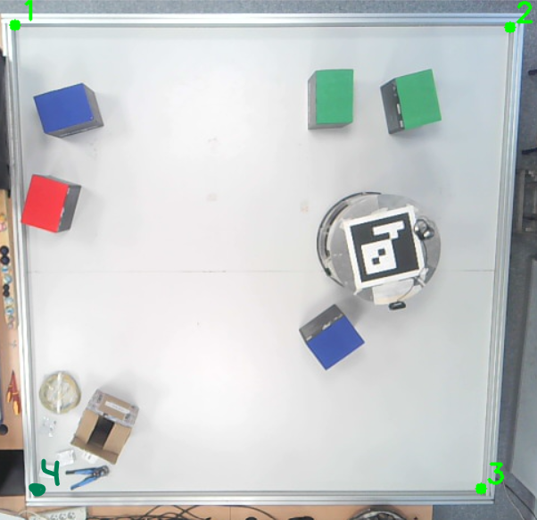
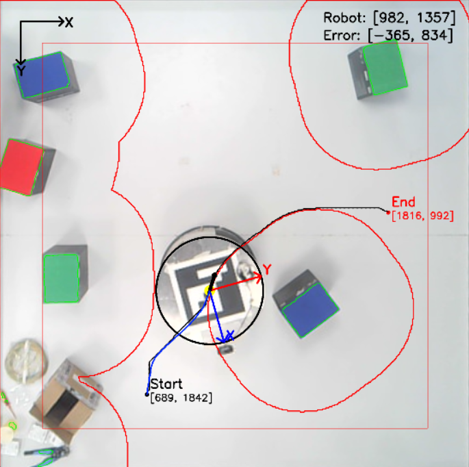
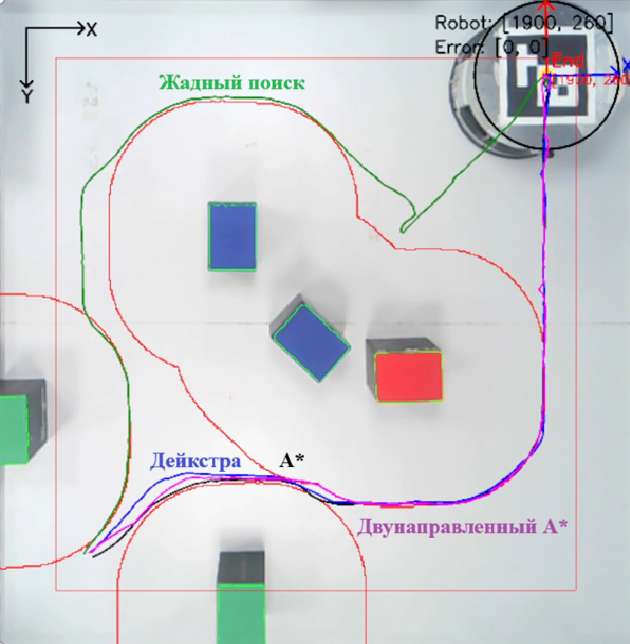
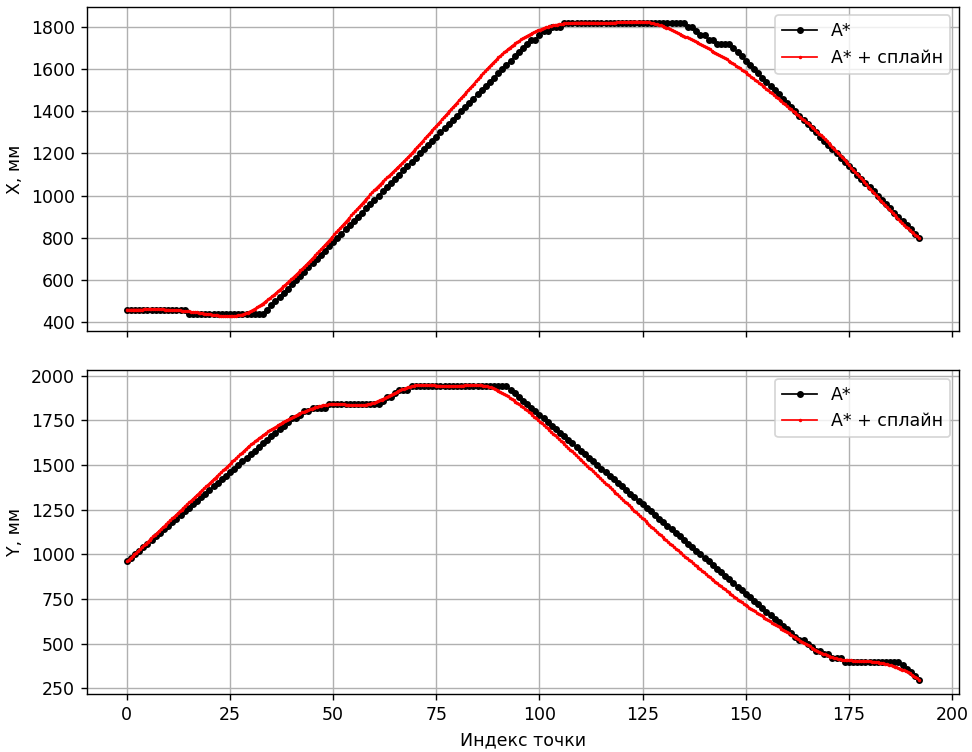
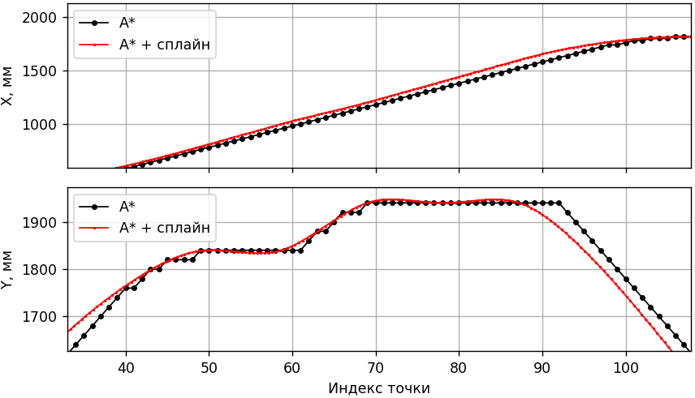

# Мобильные роботы

**Курс/семестр:** 1 курс магистратуры, 2 семестр (весна 2026 года)  
**Номер лабораторной:** 1-3  
**Студент:** Якушев Никита Евгеньевич  
**Группа:** 8EM51  
**Преподаватель по лабораторным работам:** Поберёзкин Никита  
**Преподаватель по курсовой работе:** Беляев Александр Сергеевич  
**Версия Python:** Python 3.13  

**Ссылки на отчёты:**
* [Лабораторная работа №1 в Google Docs](https://docs.google.com/document/d/1OzHcff0b5MfZz3JZjb0_KsUlTrQxqRXBsTYikQ4UG8c/edit?tab=t.0)
* [Лабораторная работа №2 в Google Docs](https://docs.google.com/document/d/1P1XCNXuoWt1bA4Bp6j5nDD3500sGrTs5VkbxkJCYhis/edit?tab=t.0)
* [Лабораторная работа №3 в Google Docs](https://docs.google.com/document/d/1P59M9zPw2dFoaWq9xPa6YhriFpmAN9EPjs27yf87d9k/edit?tab=t.0)
* [Курсовая работа в Google Docs](https://docs.google.com/document/d/1sZr2Ce85T_aD8pxh478bZUNdoREVir9Y6QOWlTRmzOM/edit?tab=t.0)

**Файлы отчётов:** 
- [Отчёт по лабораторной работе №1 в формате *PDF*](Documents/МобилРоб_ЛБ1_Якушев.pdf)
- [Отчёт по лабораторной работе №2 в формате *PDF*](Documents/МобилРоб_ЛБ2_Якушев.pdf)
- [Отчёт по лабораторной работе №3 в формате *PDF*](Documents/МобилРоб_ЛБ3_Якушев.pdf)
- [Отчёт по курсовой работе в формате *PDF*](Documents/МобилРоб_Курсовая_Якушев.pdf)

## 1. Задачи работы

### 1.1 Задание лабораторной работы №1
> * **Основное задание** — реализация управления мобильным роботом Robotino **с объездом статических препятствий**.
> * **Исходные данные** — на поле 2200х2200 мм находится 5 статических препятствий (вид и размеры препятствия на выбор исполнителя).
> * **Что необходимо** — требуется реализовать движение робота из точки А в точку Б с выводом координат робота и отображения пройденного пути.

### 1.2 Задание лабораторной работы №2
> * **Основное задание** — реализация и проведение **сравнительного анализа** трёх алгоритмов планирования маршрута (на выбор исполнителя).
> * **Исходные данные** — на поле 2200х2200 мм находится 5 статических препятствий (вид и размеры препятствия на выбор исполнителя).
> * **Что необходимо** — требуется реализовать движение робота из точки А в точку Б с расчётом метрик по всем алгоритмам планирования маршрута, после чего сравнить их.

### 1.3 Задание лабораторной работы №3
> * **Основное задание** — реализация управления мобильным роботом Robotino с объездом **динамических** препятствий.
> * **Исходные данные** — на поле 2200х2200 мм находится 5 динамических препятствий (вид и размеры препятствия на выбор исполнителя).
> * **Что необходимо** — требуется реализовать движение робота из точки А в точку Б с учётом движения препятствий (динамическое построение маршрута).

> [!IMPORTANT] 
> Каждая следующая лабораторная работа является надстройкой над предыдущей.

### 1.4 Задание курсовой работы
> * **Основное задание** — реализация управления мобильным роботом Robotino с объездом препятствий с использованием **сплайн-интерполяции** на основе видеоданных с камеры.
> * **Исходные данные** — на поле 2200х2200 мм находятся препятствия (вид и размеры препятствия на выбор исполнителя).
> * **Что необходимо** — требуется реализовать движение робота из точки А в точку Б с построением маршрута через сплайн-интерполяцию.

> [!IMPORTANT] 
> В связи с тем, что некоторые моменты при предоставлении задания не были учтены, выполнение заданий выполнялось при следующих условиях:
> - Для распознавания препятствий, робота и для реализации навигации использовался исключительно *видеопоток с камеры*, расположенной над центром поля.
> - В качестве препятствий выступают **яркие насыщенные цвета** (красный, синий, зелёный, жёлтый и т.д.). При работе с другими препятствиями необходима перенастройка маски препятствий.
> - Для распознавания робота используется **ArUco-маркер**, который прикреплён к центру робота и направлен в сторону локальной координаты *X*.
> - Робот осуществляет только **голономное движение** (без вращения робота вокруг вертикальной оси).

## 2. Описание робота

Объектом лабораторной работы является Robotino. Внешний вид робота идентичен изображению ниже.


Связь с роботом организуется по беспроводной сети **Wi‑Fi**.  
Robotino работает как сервер, принимающий команды через встроенный **HTTP API**.

Управление данным роботом осуществляется через отправку скоростей [*Vx, Vy, ω*] в связанной системе координат с роботом.
После отправления скоростей они проходят через обратную кинематику и преобразуются в угловые скорости колёс робота.

IP‑адрес и порт задаются в конфигурационном файле [parameters.yaml](parameters.yaml):

```yaml
socket_params:
  ip_address: '192.168.0.1'  # IP‑адрес контроллера Robotino
  port: 80                   # Порт TCP‑соединения
  enable: 1                  # Подключение к роботу (0 - без подключения, 1 - с подключением)
```

## 3. Описание директории репозитория

Для работы с проектом была разработана следующая структура проекта:

> **Git**: Позволяет отслеживать изменения кода, скриптов и имеет множество других функций. 
> Обеспечивает совместную работу, возможность отката к предыдущим состояниям и публикацию проекта на GitHub.

> **venv**: Позволяет сделать изолированную среду Python для разработки (для работы с несколькими проектами на разных версиях библиотек). 
> Также позволяет работать через [requirements.txt](requirements.txt), что позволяет достаточно быстро развернуть решение на другом устройстве.

- [photo_video](photo_video): Содержит в себе изображения для [README.md](README.md).
- [main.py](main.py): Программный файл, который содержит в себе основной код работы для всех заданий.
- [parameters.yaml](parameters.yaml): Конфигурационный файл, который содержит в себе значения настраиваемых параметров для работы всего проекта.
- [Robotino.py](Robotino.py): Программный файл с функциями для взаимодействия с Robotino.
- [Camera.py](Camera.py): Программный файл с функциями для работы с видеокамерой (находится над полем).
- [Navigation.py](Navigation.py): Программный файл с функциями для реализации алгоритмов планирования и алгоритмов построения пути.

> [!IMPORTANT] 
> Внутри программных файлов представлено подробное описание каждой функции и переменных, 
> которые используются в работе.

## 4. Инструкция для работы с проектом

После загрузки проекта необходимо инициализировать виртуальное пространство **venv** и загрузить необходимые библиотеки:

```bash
# Создание виртуального пространства с Python 3.13
python -m venv .venv
.venv\Scripts\activate

# Установка библиотек для работы (если нет requirements.txt)
pip install numpy opencv-python ...

# Установка библиотек с файла requirements.txt
pip install -r requirements.txt
```

После этого необходимо убедиться в корректности подключения и работы камеры.
Изображение с камеры должно примерно соответствовать изображению ниже.


После этого необходимо произвести настройку в [parameters.yaml](parameters.yaml). 
Подробное описание параметров приведено в самом конфигурационном файле. 
Перед работой необходимо проверить следующее:
1. Корректность IP-адреса (`ip_address`) и порта соединения (`port`) Robotino. Проверка осуществляется через подключение к роботу через **Wi‑Fi**.
2. Первый запуск **рекомендуется** делать без применения фильтра повышения резкости (`sharpening`) и коррекции маски (`parallax`). Для работы с видеопотоком необходимо параметру `online` присвоить *1* и выбрать ID нужной камеры (`ideo_stream`).
3. После подключения камеры необходимо выбрать 4 угла рабочей зоны (принимается, что рабочая зона имеет форму квадрата). Углы необходимо задавать левой кнопкой мыши (см. изображение ниже). Если изображение слишком большое или маленькое, настройте масштаб отображения окна калибровки (`calibration_display_scale`).



> [!IMPORTANT] 
> При настройке границ нажимать необходимо в следующем порядке [*верх-лево, верх-право, низ-право, низ-лево*].

4. После этого у вас должно открыться новое окно с ограниченным кадром по заданным границам. В данном пункте необходимо настроить следующие параметры: `scale_factor`, `scale_factor_mask`, `working_display_scale`, `resolution`, `wall_width` и `add_zone`. Эти параметры позволят настроить масштаб окна для работы, масштаб маски для работы с масками (влияет на скорость и точность вычислений), размер виртуальной стены от границ кадра и размер дополнительной зоны от препятствий.

> [!IMPORTANT] 
> При необходимости можете применить настройку `sharpening` и `parallax` (при включении необходимо дополнительно стоит настроить параметры `H`, `h`, `offset_x` и `offset_y`).

5. При успешном подключении к роботу и к камере появляется возможность задать точку для достижения роботом. Точку стоит задать в доступном для робота месте (в ином случае движение не будет). Примерный вид интерфейса рабочего окна представлен на изображении ниже. На рабочем окне имеются следующие элементы интерфейса:
- Отображение глобальной системы координат кадра (*левый-верхний угол*).
- Отображение центра робота и локальной системы координат робота (*зависит только от положения ArUco-маркера*).
- Отображение информации о позиции робота и значении ошибки в миллиметрах (*правый-верхний угол*).
- Точка старта и конца с отображением координат точек в миллиметрах (*точка старта — чёрный цвет, а точка конца — красный цвет*).
- Отображение желаемого пути (*тонкая чёрная линия*) и пройденного пути (*синяя линия*). При прохождении пути желаемый путь становить серым.
- Отображение границ препятствий зелёным цветом. Расширенная маска препятствий изображена толстой красной линией.
- Отображение границ поля движения робота тонкой красной линией (*учитывают угол камеры и возможное приближение робота к стенам поля*).



6. Если робот успешно двигается по полю, необходимо проверить корректность значений параметров `smoothing`, `acceptable_error`, `radius` и `max_speed`.
7. После настройки всех параметров можно выбрать алгоритм планирования (`algorithm`) и режим обновления маршрута (`dynamic_update`).
8. Настройка завершена.

> [!IMPORTANT] 
> При возникновении различного рода ошибок ориентируйтесь на информацию с консоли.

## 5. Описание процесса выполнения лабораторной работы №1
Всю работу над лабораторной работой №1 можно разделить на 3 этапа:
1. Обработка видеопотока и формирование маски (робот, препятствия и стены).
2. Разработка и внедрение алгоритма построения и планирования маршрута.
3. Разработка и внедрение алгоритма движения (формирование линейных скоростей).

Качество выполнение каждого этапа существенно влияло на итоговый результат (особенно пункт №1).
Ниже приведём описание каждого из этапов работы.

### 5.1 Работа с видеопотоком
Обработка каждого кадра видеопотока состоит из нескольких последовательных
этапов: 
- Калибровка и выравнивание видеопотока.
- Трекинг робота с использованием ArUco-метки.
- Выделение препятствий (с учётом расширения) и зоны для работы робота.
- Отображение на видеопотоке информации об координатных осях, роботе, препятствиям и др.

> [!IMPORTANT] 
> Последовательность и содержание пунктов не зависят от способа получения видеопотока (с камеры или с видео-файла).

#### 5.1.1 Калибровка и выравнивание изображения
При выполнении лабораторной работы используется видеопоток с одной камеры.
Крайне важно, чтобы изображение было чётким, так как от этого напрямую зависит
надёжность распознавания ArUco‑метки на роботе. Для улучшения чёткости в
программе предусмотрена возможность применения **фильтра резкости**. 

```main.py
sharpening_kernel = np.array([
    [0, -1, 0],
    [-1, 5, -1],
    [0, -1, 0]
], dtype=np.float32)
```

Сумма коэффициентов ядра равна единице, поэтому общая яркость изображения не
меняется. Центральный пиксель усиливается, а соседние ослабляются, что
подчёркивает перепады яркости на границах объектов. Свёртка выполняется
функцией `cv2.filter2D` непосредственно после захвата кадра.

Первым делом исходный видеопоток с помощью обозначения 4 углов. 
Четыре угла рабочей области задаются вручную мышью на первом кадре в
режиме `calibrate`. Пользователь левой кнопкой мыши нажимает на четыре точки
в порядке: левый‑верх, правый‑верх, правый‑низ, левый‑низ. 

Так как камера расположена под углом к плоскости полигона и при этом она 
смещена от центра на некоторое расстояние, из-за исходного
изображение содержит перспективные искажения (квадратное поле
превращается в трапецию). Чтобы устранить эти искажения, используется
**гомография** – перспективное преобразование, которое переводит точки из
плоскости кадра в плоскость «вид сверху».
После четвёртого клика система вычисляет матрицу перспективного 
преобразования `perspective_matrix` с помощью `cv2.getPerspectiveTransform`.

#### 5.1.2 Трекинг робота
На роботе закреплён **ArUco‑маркер** размером 6×6. После выравнивания
кадра маркер определяется функцией `cv2.aruco.detectMarkers`. Координаты центра
маркера (`center_x, center_y`) вычисляются как среднее арифметическое
координат его углов.

Определение угла поворота робота осуществляется через **ArUco‑маркер**, 
направление которого совпадает с осью X робота (локальная система координат).
Угол `angle` вычисляется через арктангенс, который учитывает также знаки аргументов.

#### 5.1.3 Выделение препятствий и построение масок
Обнаружение препятствий выполняется с помощью цветовой фильтрации в
пространстве **HSV**. Такой подход (почти) не зависит от яркости освещения, 
что является крайне необходимым для корректной работы проекта. 
Однако, тени от объектов могут значительно повлиять на качество работы.

Алгоритм построения маски включает следующие шаги:
1. **HSV‑фильтрация.** Кадр переводится в HSV, после чего к нему
   применяется `cv2.inRange`. Диапазон `(H:0…179, S:100…255, V:135…255)`
   выделяет достаточно насыщенные и яркие цвета.
2. **Морфологическая очистка.** Применяется операция открытия (эрозия+дилатация)
   (`cv2.MORPH_OPEN`) с ядром 10×10 пикселей для удаления мелкого шума.
3. **Коррекция параллакса.** Так как камера находится на высоте `H` над
   полом, а препятствия имеют высоту `h`, их изображение смещается
   относительно реального положения. Функция `project_mask`
   корректирует этот эффект: маска сжимается к точке проекции оптического
   центра камеры с коэффициентом `k = (H - h) / H` (аффинное преобразование).
   Однако, данная операция при повороте камеры и её смещении может привести к некорректному результату.
   Поэтому была добавлена возможность отключения данной операции через конфигурационный файл.
4. **Виртуальные стены.** По краям маски добавляются «стены» шириной
   `wall_width` пикселей (в нашем случае 200 мм). Они не позволяют роботу выезжать
   за пределы допустимой области. Это необходимо для того, чтобы робот 
   не выезжал за зону работы камеры и не врезался в стены.
5. **Расширение на радиус робота.** Чтобы учесть геометрию робота при планировании маршрута,
   полученная маска препятствий расширяется морфологической операцией — **дилатация**
   с ядром. Размер расширения равен радиусу робота плюс дополнительный отступ
   (`extra_offset_px`). Данный отступ необходим для компенсации искажения, 
   из-за которого в разных частях поля робот проезжал на разном расстоянии от препятствия.

После работы всех алгоритмов происходит объединение маски расширенных
препятствий и маски со стенами. Данная маска далее используется 
алгоритмами глобального планирования.

#### 5.1.4 Визуализация масок и систем координат
Для отрисовки всех элементов на рабочей области последовательно 
применяются следующие методы *OpenCV*: 
* `cv2.findContours` (поиск границ объектов в бинарной маске), 
* `cv2.drawContours` (отрисовка контуров линиями заданной толщины и цвета), 
* `cv2.rectangle` (прямоугольник границы допустимой зоны), 
* `cv2.circle` (жёлтый центр робота и чёрная окружность его габарита), 
* `cv2.arrowedLine` (стрелки локальных и глобальных осей координат), 
* `cv2.putText` (текстовые метки координат, названий осей и подписей *Start/End*).

Описание содержимого интерфейса было произведено в **главе №4**.

### 5.2 Построение маршрута движения
Построение маршрута от текущего положения робота до заданной
цели с учётом препятствий является центральной задачей данной работы. 
Для её решения рабочая область преобразуется в **дискретную сетку** 
(поле представляет собой набор множества точек), 
после чего применяются алгоритмы поиска пути.

#### 5.2.1 Дискретизация карты
В разделе `5.1.3 Выделение препятствий и построение масок` была определена
бинарная маска, которая содержит в себе данные об препятствиях и виртуальной стене.
Данная маска перед передачей планировщику уменьшается в
`scale_algorithm` раз (в нашем случае 0.2). Без этого алгоритму необходимо 
перебрать большое количество вариантом (чуть ли не миллиард), что занимает большое
количество времени.

Координаты робота и цели пересчитываются в индексы сетки `(row, col)`,
после чего запускается алгоритм планирования маршрута. 
Полученный путь преобразуется обратно в пиксельные координаты рабочей области.

#### 5.2.2 Алгоритмы поиска пути
В программе реализованы четыре классических алгоритма, которые можно
выбирать через параметр `algorithm` в конфигурации:

- **A*** – эвристический алгоритм, гарантирующий оптимальный путь.
  Использует функцию стоимости `f(n) = g(n) + h(n)`, где `g(n)` –
  пройденное расстояние, `h(n)` – евклидова эвристика до цели.
  Благодаря эвристике посещает значительно меньше узлов, сохраняя оптимальность.

- **Дейкстра** – частный случай **A*** с нулевой эвристикой (`h(n)=0`). 
  Работает медленнее, но не требует настройки эвристики.
  Используется как эталон кратчайшего пути.

- **Жадный поиск** – использует только эвристику `h(n)`, 
  игнорируя пройденный путь. Работает очень быстро, однако не
  гарантирует оптимальность и может приводить к извилистым маршрутам.
 
Все 3 алгоритма описывают все варианты построения маршрута.
Для выполнения лабораторной работы №1 будет реализован **A***.

Также при планировании маршрута учитываются следующие ситуации:

- Если путь не найден (если точка стоит в недоступной области), 
  робот останавливается и ожидает новой команды.

- **Старт внутри препятствия.** Возможна ситуация, когда робот находится 
  в зоне препятствия. В этом случае планировщик не может начать построение
  маршрута. Для выхода из такой ситуации реализована функция `find_nearest_free`, 
  которая ищет ближайшую свободную ячейку в радиусе (выход из препятствия). 
  Если такая ячейка найдена, старт переносится в неё, и путь строится от этой 
  точки, позволяя роботу сначала покинуть препятствие.

#### 5.2.3 Алгоритм следования маршруту
Глобальный путь представляет собой последовательность точек. Для
обеспечения плавного движения робот не стремится к очередной точке
напрямую, а использует **упреждённую точку**. Разработанная функция 
`get_lookahead_point` находит на плановом пути точку,
отстоящую от ближайшей к роботу точки на расстояние `smoothing_px` 
(в нашем случае 80 мм). Это обеспечивает непрерывное движение без остановок
на промежуточных узлах и сглаживает траекторию. Данный подход приводит к
незначительному снижению скорости на поворотах.

#### 5.2.4 Визуализация маршрута
На рабочую область выводятся:
- **Чёрная стрелка от центра робота** – вектор направления результирующей скорости.
- **Синяя линия** – реальная траектория движения робота.
- **Тонкая чёрная линия** – планируемая траектория движения робота.
- **Тонкая серая линия** – планируемая траектория движения робота после завершения движения.

Данная визуализация позволяет получить достаточное количество информации с видеопотока.
Можно проанализировать качество следованию маршрута, корректность формирования
результирующей скорости и др. параметры.

### 5.3 Подключение к Robotino и формирование управляющих сигналов

#### 5.3.1 Расчёт скоростей движения
Вектор скорости робота формируется на основе глобального пути
с помощью пропорционального регулятора. В каждый момент времени
определяется **упреждённая точка** – точка на
запланированном маршруте, отстоящая от текущего положения робота
на расстояние `smoothing_px` (в нашем случае 80 мм). 
При приближении к конечной цели на расстояние `acceptable_error_px`
(в нашем случае 20 мм) движение останавливается.

Полученный в глобальной системе координат рабочей области вектор
скорости `velocity` должен быть пересчитан в систему координат,
связанную с роботом. Для этого используются две матрицы:

```main.py
# Поворот на 90 градусов
comp_matrix = [[0, 1], [-1, 0]]

# Матрица поворота для перевода скоростей из глобальной системы координат в локальную
rotation_matrix = [[cos(angle), -sin(angle)], [sin(angle), cos(angle)]]

# Перевод из глобальной системы координат в локальную 
Vx, Vy = velocity @ comp_matrix @ rotation_matrix
```

#### 5.3.2 Отправка команд роботу
Robotino оснащён встроенным веб-сервером, доступным по **Wi‑Fi**.
Управление движением осуществляется отправкой HTTP‑запроса на
URL вида `http://<IP>/data/omnidrive`.

Тело запроса представляет собой JSON‑массив из трёх чисел:
`[Vx, Vy, 0]` (т.к. голономное движение). 
Функция `send_velocity` модуля `Robotino.py` формирует запрос 
и проверяет код ответа. При успешном ответе (статус `200`) 
команда считается исполненной. В случае сетевой ошибки 
выводится предупреждение.

#### 5.3.3 Метрики качества
После завершения каждого маршрута (только в статическом режиме)
рассчитываются показатели:
- **Время прохождения маршрута** – от момента клика до достижения цели.
- **Планируемый путь** – длина глобального пути (мм).
- **Пройденный путь** – фактическая длина траектории робота (мм).
- **MSE** – среднеквадратичное отклонение траектории от плана (мм²).
- **R²** – коэффициент детерминации, характеризующий, насколько точно
  робот следовал запланированной траектории (1.0 – полное соответствие,
  отрицательные значения – траектория хуже простого среднего).

Эти метрики позволяют количественно оценивать качество проезда траектории.

### 5.4 Подведение итогов

В результате выполнения лабораторной работы была реализована система
автономной навигации мобильного робота Robotino в замкнутой рабочей
области с известными статическими препятствиями. На рисунке ниже
представлена анимированная запись одного из успешных проездов,
демонстрирующая работу всех компонентов системы в реальном времени.


#### Количественная оценка качества
После завершения маршрута были автоматически рассчитаны метрики движения:

- **Время прохождения маршрута:** 38.354 с.
- **Планируемый путь:** 3523.5 мм (длина глобального маршрута, построенного
  алгоритмом A*).
- **Пройденный путь:** 3461.1 мм (фактическая длина траектории робота).
- **MSE:** 164.634 мм² (среднеквадратичное отклонение траектории от
  запланированного пути).
- **R²:** 0.9996 (коэффициент детерминации).
- **Количество точек пути:** 333 (число точек в глобальном плане).

Анализ метрик показывает высокую точность следования по маршруту:
фактически пройденный путь практически совпадает с плановым (разница
около 62 мм), среднеквадратичное отклонение
составляет всего 164.6 мм² (среднее отклонение примерно 12.8 мм),
а коэффициент детерминации R² близок к единице. Это говорит о том,
что реализованный пропорциональный регулятор скорости в сочетании
с алгоритмом езды по упреждённой точки и алгоритмом A* обеспечивает
стабильное и точное движение робота по заданной траектории.

> [!IMPORTANT] 
> Поставленные цели лабораторной работы были достигнуты.

## 6. Описание итогов выполнения лабораторной работы №2

Целью лабораторной работы №2 является проверка **качества работы алгоритмов планирования маршрута**. 
Все остальные компоненты системы (калибровка, выделение препятствий, трекинг робота, 
отправка управляющих сигналов) полностью совпадают с описанными в лабораторной работе №1.

> [!IMPORTANT] 
> Остальные функции и подходы идентичны лабораторной работе №1.

### 6.1 Реализация автоматического перебора алгоритмов

Для сравнения алгоритмов был реализован автоматический режим,
управляемый параметром `auto_mode.enable` в конфигурационном файле [parameters.yaml](parameters.yaml).
В этом режиме программа последовательно тестирует каждый из четырёх алгоритмов (A*, Дейкстра,
жадный поиск, двунаправленный A*) на **одном и том же маршруте** – от стартовой точки до
целевой и обратно.

В файле [parameters.yaml](parameters.yaml) задаются координаты начальной и конечной точек:

```yaml
auto_mode:
  enable: 1          # Автоматический режим (0 - движение через клики, 1 - движение через
  start_x: 1900      # X-координата начальной точки (пкс)
  start_y: 300       # Y-координата начальной точки (пкс)
  end_x: 300         # X-координата конечной точки (пкс)
  end_y: 1900        # Y-координата конечной точки (пкс)
```

В файле `main.py` был встроен алгоритм для автоматического проезда траекторий:

```main.py
# Автоматический режим (ЛБ2)
if auto_mode_enable:
    if global_path:
        auto_last_path = global_path.copy()
    if auto_phase == 'to_start':
        click_point = np.array([auto_start[1], auto_start[0]])
        algorithm = "astar"
        
        if not motion_started:
            motion_started = True
            start_time_task = time.time()
            start_point = robot_position.copy()
            
        if np.linalg.norm(robot_position - auto_start[::-1]) < acceptable_error_px:
            auto_phase = 'to_target'
            auto_algo_idx = 0
            motion_started = False  
            auto_pause_until = time.time() + 5.0
            click_point = np.array([auto_end[1], auto_end[0]])
            algorithm = auto_algorithms[auto_algo_idx]
            trajectory.clear()
            print(f"Начало тестирования: {algorithm}")
    elif auto_phase == 'to_target':
        if time.time() < auto_pause_until:
            motion_started = False
        else:
            if not motion_started:
                motion_started = True
                start_time_task = time.time()
                start_point = robot_position.copy()
        if np.linalg.norm(robot_position - auto_end[::-1]) < acceptable_error_px:
            if trajectory:
                path_for_metrics = auto_last_path if auto_last_path else global_path
                metrics = compute_metrics(start_time_task, trajectory.copy(), path_for_metrics.copy(),
                                          pixel_per_mm)
                print(f"Метрики движения ({algorithm}):")
                print(f"Время прохождения маршрута: {metrics['time_s']} с")
                print(f"Планируемый путь: {metrics['planned_length_mm']} мм")
                print(f"Пройденный путь: {metrics['actual_length_mm']} мм")
                print(f"MSE (мм²): {metrics['mse_mm2']}")
                if metrics['r_squared'] is not None:
                    print(f"R² (коэффициент детерминации): {metrics['r_squared']}")
                print(f"Количество точек пути: {metrics['num_points']}")
            auto_trajectories.append((algorithm, trajectory.copy()))
            auto_phase = 'to_return'
            motion_started = False
            auto_pause_until = time.time() + 2.0
            click_point = np.array([auto_start[1], auto_start[0]])
            algorithm = "astar"
            trajectory.clear()
            print("\nВозврат на старт (astar)\n")
    elif auto_phase == 'to_return':
        if time.time() < auto_pause_until:
            motion_started = False
        else:
            if not motion_started:
                motion_started = True
                start_time_task = time.time()
                start_point = robot_position.copy()
        
        if np.linalg.norm(robot_position - auto_start[::-1]) < acceptable_error_px:
            auto_algo_idx += 1
            if auto_algo_idx < len(auto_algorithms):
                auto_phase = 'to_target'
                motion_started = False
                auto_pause_until = time.time() + 2.0
                algorithm = auto_algorithms[auto_algo_idx]
                click_point = np.array([auto_end[1], auto_end[0]])
                trajectory.clear()
                print(f"Тестирование: {algorithm} ")
            else:
                auto_phase = 'finished'
                motion_started = False
                click_point = None
                start_point = None
                global_path = []
                trajectory.clear()
                last_completed_path = None
                
    elif auto_phase == 'finished':
        motion_started = False
        click_point = None
```

Сам цикл автоматического тестирования состоит
из следующих этапов, управляемых переменной `auto_phase`:

1. `to_start` – если робот не находится в стартовой точке, он сначала едет к ней
(используется алгоритм **A***).
2. `to_target` – робот движется от старта к целевой точке, используя тестируемый алгоритм. 
После достижения цели в консоль выводятся метрики движения.
3. `to_return` – робот возвращается на стартовую точку (также через **A***), чтобы следующий
алгоритм стартовал из того же положения.
4. `finished` – робот перестаёт двигаться и отображает на экране все траектории по цветам.

### 6.2 Анализ результатов и метрик

В результате выполнения лабораторной работы был реализован режим автоматического
проезда каждым алгоритмом с одной точки к другой. На видео ниже представлена
анимированная запись одного из успешных проездов,
демонстрирующая работу всех компонентов системы в реальном времени.


Ниже представлен результат проезда всех траекторий. 



<table align="center">
  <thead>
    <tr>
      <th align="center">Алгоритм</th>
      <th align="center">Цвет линии</th>
      <th align="center">Время (с)</th>
      <th align="center">Планируемый путь (мм)</th>
      <th align="center">Пройденный путь (мм)</th>
      <th align="center">MSE (мм²)</th>
      <th align="center">R²</th>
      <th align="center">Точек пути</th>
    </tr>
  </thead>
  <tbody>
    <tr>
      <td align="center">A*</td>
      <td align="center" style="color:black; font-weight:bold;">Чёрный</td>
      <td align="center"><strong>34,694</strong></td>
      <td align="center"><strong>3027,31</strong></td>
      <td align="center"><strong>3025,48</strong></td>
      <td align="center"><strong>73,779</strong></td>
      <td align="center"><strong>0,9999</strong></td>
      <td align="center"><strong>145</strong></td>
    </tr>
    <tr>
      <td align="center">Дейкстра</td>
      <td align="center" style="color:blue; font-weight:bold;">Синий</td>
      <td align="center">34,766</td>
      <td align="center">3063,53</td>
      <td align="center">3076,08</td>
      <td align="center">117,497</td>
      <td align="center">0.9998</td>
      <td align="center">147</td>
    </tr>
    <tr>
      <td align="center">Жадный</td>
      <td align="center" style="color:darkgreen; font-weight:bold;">Тёмно-зелёный</td>
      <td align="center">38,942</td>
      <td align="center">3863,45</td>
      <td align="center">3604,66</td>
      <td align="center">117,24</td>
      <td align="center">0,9998</td>
      <td align="center">175</td>
    </tr>
    <tr>
      <td align="center">Двунаправленный A*</td>
      <td align="center" style="color:fuchsia; font-weight:bold;">Фиолетовый</td>
      <td align="center">34,878</td>
      <td align="center">3033,53</td>
      <td align="center">3088,18</td>
      <td align="center">126,641</td>
      <td align="center">0,9998</td>
      <td align="center"><strong>145</strong></td>
    </tr>
  </tbody>
</table>

1. **Время прохождения**. Наименьшее время показал алгоритм **A***. 
Остальные алгоритмы потребовали на 2–6 с больше. 
Разница во времени объясняется длиной проложенного пути другими алгоритмами.
Но результат физически обоснован: больше маршрут -> больше время прохождения.


2. **Длина планируемого и пройденного пути**. **A*** снова оказался лучше по двум показателям. 
У остальных алгоритмов плановая длина была заметно больше (особенно сравнивая с жадным алгоритмом). 
Это напрямую связано с *эвристикой*: **A*** использует евклидово 
расстояние до цели, что позволяет ему строить почти прямые маршруты. Дейкстра, 
лишённый эвристики, часто делает изгибы, а жадный алгоритм, выбирающий 
локально наилучший шаг, склонен к значительным отклонениям.


3. **Точность следования**. Все алгоритмы продемонстрировали очень высокую точность: 
*коэффициент детерминации R²* близок к единице, а среднеквадратичное 
отклонение (MSE) находится в пределах 41–127 мм², что соответствует среднему линейному 
отклонению около 6–11 мм. Это говорит о том, что разработанные алгоритмы (П-регулятор и механизм упреждения)
одинаково хорошо отрабатывают любой план, независимо от его формы. 
Наилучшее значение MSE (41.87 мм²) **неожиданно** показал жадный алгоритм, что, на самом деле,
очень странно, учитывая большее число изгибов. Однако разница в MSE между алгоритмами невелика и не является определяющей.


4. **Количество точек пути**. Число узлов в плане не оказывает заметного влияния 
на скорость или точность. Жадный алгоритм, как и ожидалось, сгенерировал наибольшее 
количество точек, что отражает его локальный характер построения маршрута, 
но это не привело к ухудшению точности.

### 6.3 Подведение итогов к лабораторной работе №2

Сравнительный анализ подтверждает, что для навигации в замкнутом полигоне с известными 
статическими препятствиями наиболее целесообразно использовать алгоритм **A*** как 
сбалансированный по длине пути, времени движения и точности. Дейкстра и двунаправленный 
**A*** могут рассматриваться как альтернативы в специфических условиях, а жадный алгоритм,
несмотря на высокую вычислительную скорость, даёт значительно более длинные маршруты.

> [!IMPORTANT] 
> Поставленные цели лабораторной работы были достигнуты.

## 7. Описание итогов выполнения лабораторной работы №3
Целью лабораторной работы №3 является реализация **динамического обновления траектории** — 
маршрут перестраивается заново на каждом кадре видеопотока. 
Все остальные компоненты системы (калибровка, выделение препятствий, трекинг робота, 
отправка управляющих сигналов) полностью совпадают с описанными в лабораторной работе №1.

> [!IMPORTANT] 
> Остальные функции и подходы идентичны лабораторной работе №1.

### 7.1 Отличие от статического планирования
В статическом режиме глобальный путь строится однократно в момент
постановки цели и остаётся неизменным до её достижения или до нового клика. 
**Главный минус данного подхода** — работа только со статическими препятствиями. 
В динамическом режиме маршрут пересчитывается **каждый кадр**.

### 7.2 Реализация динамического обновления
Переключение между режимами осуществляется параметром `dynamic_update` 
конфигурационном файле [parameters.yaml](parameters.yaml).
При `dynamic_update = 1` условие выполняется на каждом кадре, 
и планировщик запускается заново.

Таким образом, на каждом кадре робот получает наиболее актуальный план, учитывающий
текущее положение препятствий. Частота обновления ограничена только временем выполнения
алгоритма, которое благодаря уменьшению маски остаётся в пределах нескольких миллисекунд.

Такой подход имеет свои преимущества и недостатки.

+ С одной стороны, он позволяет обойтись без тонкой настройки потенциальных полей
и гарантирует, что маршрут всегда является глобально оптимальным для текущего
положения препятствий. 

- С другой стороны, при высокой скорости движения может
возникать запаздывание, если алгоритм не успевает перестроить путь до
столкновения и необходимы более высокие вычислительные мощности для работы.
В рамках лабораторной работы при умеренных скоростях робота
этот подход показал стабильную и безопасную работу.

### 7.3 Подведение итогов

В результате выполнения лабораторной работы была реализована система
автономной навигации мобильного робота Robotino в замкнутой рабочей
области с известными статическими/динамическими препятствиями. На рисунке ниже
представлена анимированная запись одного из успешных проездов,
демонстрирующая работу всех компонентов системы в реальном времени.


> [!IMPORTANT] 
> Поставленные цели лабораторной работы были достигнуты.

## 8. Описание итогов выполнения курсовой работы

Целью курсовой работы является реализация управления мобильным роботом Robotino с
объездом препятствий на основе **сплайн-интерполяции** маршрута, построенного
алгоритмом глобального планирования. 

Вся остальная инфраструктура системы
(калибровка, выделение препятствий, трекинг робота, отправка управляющих сигналов)
остаётся идентичной описанной в лабораторных работах №1–3.

> [!IMPORTANT]
> Дополнительные функции и подходы, не связанные со сплайн-интерполяцией,
> полностью совпадают с лабораторной работой №1.

### 8.1 Отличие от дискретного планирования

В предыдущих реализациях глобальный путь представлял собой ломаную линию 
(набор точек, которые соединялись линиями). 
Такой маршрут содержит множество изломов, так как точки ставятся по сетке
и в каждом шаге возможно движение по одному из восьми направлений. 

Робот вынужден последовательно проходить все
промежуточные точки, что приводит к резким изменениям направления и неоптимальной
траектории. Робот начинает "срезать" путь, из-за чего снижается точность движения.

Применение **сплайн-интерполяции** позволяет превратить ломаную траекторию в
гладкую кривую, которую робот может проехать с постоянной скоростью без рывков.
Плавность движения повышает точность следования и снижает нагрузку на приводы.

### 8.2 Реализация сплайн-интерполяции

Режим сплайнового движения активируется параметром `spline.enable` в
конфигурационном файле [parameters.yaml](parameters.yaml). При его включении
обработка маршрута после получения от алгоритма A* (или другого) выполняется
следующими этапами:

1. **Упрощение исходного пути**  
   Ломаная линия, полученная от алгоритма, упрощается простым пропуском n-го числа точек 
   (регулируется параметром `subsample_step`).

2. **Построение сглаженного сплайна**  
   Оставшиеся после упрощения опорные точки используются для построения
   кубического сплайна функцией `generate_spline_path`. Сплайн параметризуется
   по длине, и новые точки генерируются с заданным шагом, определяемым
   параметром `spline_step_mm` (миллиметры). Это обеспечивает равномерное
   распределение точек вдоль всей траектории независимо от её длины.

3. **Замена глобального пути**  
   Исходный дискретный путь `global_path` заменяется на плотную
   последовательность точек сплайна. Последняя точка принудительно совпадает
   с целевой координатой, чтобы робот гарантированно достигал цели.

Сплайн строится **однократно при постановке новой цели** и не пересчитывается
динамически, чтобы избежать колебаний траектории. При изменении цели или
завершении движения путь сбрасывается.

> [!IMPORTANT]
> Одни точки заменяются другими.

### 8.3 Управление движением по сплайну

После замены `global_path` на сплайновый маршрут механизм управления движением
остаётся прежним. Благодаря тому, что
точки сплайна расположены близко друг к другу,
упрёждённая точка движется практически непрерывно, и робот плавно скользит
вдоль заданной кривой.

### 8.4 Визуализация сплайнового пути

Для отладки и контроля на рабочую область выводятся:
- **серая линия** – исходная траектория планировщика;
- **красные круги** – опорные точки после упрощения;
- **чёрные точки** – точки самого сплайна;

Такая детализация позволяет оценить качество упрощения и гладкость сплайна,
а также убедиться, что траектория не пересекает препятствия.

### 8.5 Подведение итогов

В рамках курсовой работы был разработан и интегрирован в существующую
систему навигации модуль сплайн-интерполяции маршрута. Сплайновый путь
позволяет роботу двигаться плавно, без резких поворотов, что
потенциально повышает точность и качество движения.

Ниже представлено видео проезда траектории, а также графики для сравнения
траекторий по двум осям (X и Y). 






> [!IMPORTANT] 
> Поставленные цели курсовой работы были достигнуты.