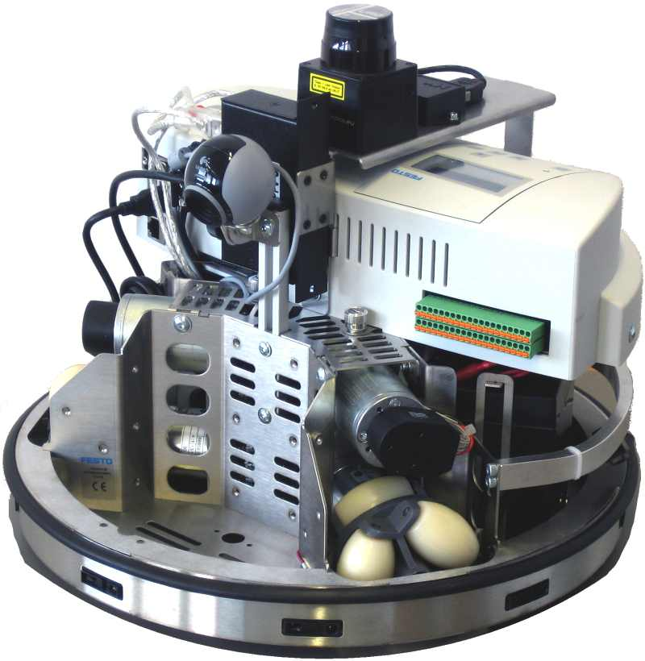
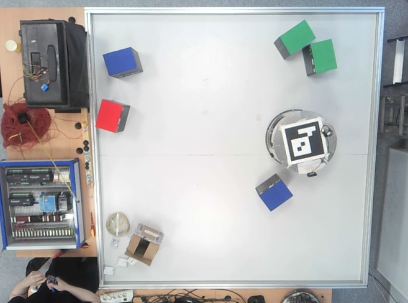

# Мобильные роботы

**Курс/семестр:** 1 курс магистратуры, 2 семестр (весна 2026 года)  
**Номер лабораторной:** 1-3  
**Студент:** Якушев Никита Евгеньевич  
**Группа:** 8EM51  
**Преподаватель:** Поберёзкин Никита  
**Версия Python:** Python 3.13  
**Ссылка на отчёты:**
* Лабораторная работа №1 [Отчёт по лабораторной работе №1](https://docs.google.com/document/d/1UMz-xYKKhZLf0U9aFKcYGgDzugf-gfL6NyTkuh6I-pc/edit?tab=t.0)
* Лабораторная работа №2 [Отчёт по лабораторной работе №2](https://docs.google.com/document/d/1UMz-xYKKhZLf0U9aFKcYGgDzugf-gfL6NyTkuh6I-pc/edit?tab=t.0)
* Лабораторная работа №3 [Отчёт по лабораторной работе №3](https://docs.google.com/document/d/1UMz-xYKKhZLf0U9aFKcYGgDzugf-gfL6NyTkuh6I-pc/edit?tab=t.0)
* Курсовая работа (в процессе)

**Файл отчётов:** 
- [Отчёт по лабораторной работе №1 в формате *PDF*](МетодыИИ_Маг_ЛБ3_Якушев.pdf)
- [Отчёт по лабораторной работе №2 в формате *PDF*](МетодыИИ_Маг_ЛБ3_Якушев.pdf)
- [Отчёт по лабораторной работе №3 в формате *PDF*](МетодыИИ_Маг_ЛБ3_Якушев.pdf)
- [Отчёт по курсовой работе в формате *PDF*](МетодыИИ_Маг_ЛБ3_Якушев.pdf)

## 1. Задачи работы

### Задание лабораторной работы №1
> * **Основное задание** — реализация управления мобильным роботом Robotino **с объездом статических препятствий**.
> * **Исходные данные** — на поле 2200х2200 мм находится 5 статических препятствий (вид и размеры препятствия на выбор исполнителя).
> * **Что необходимо** — требуется реализовать движение робота из точки А в точку Б с выводом координат робота и отображения пройденного пути.

### Задание лабораторной работы №2
> * **Основное задание** — реализация и проведение **сравнительного анализа** трёх алгоритмов планирования маршрута (на выбор исполнителя).
> * **Исходные данные** — на поле 2200х2200 мм находится 5 статических препятствий (вид и размеры препятствия на выбор исполнителя).
> * **Что необходимо** — требуется реализовать движение робота из точки А в точку Б с расчётом метрик по всем алгоритмам планирования маршрута, после чего сравнить их.

### Задание лабораторной работы №3
> * **Основное задание** — реализация управления мобильным роботом Robotino с объездом **динамических** препятствий.
> * **Исходные данные** — на поле 2200х2200 мм находится 5 динамических препятствий (вид и размеры препятствия на выбор исполнителя).
> * **Что необходимо** — требуется реализовать движение робота из точки А в точку Б с учётом движения препятствий (динамическое построение маршрута).

> [!IMPORTANT] 
> Каждая следующая лабораторная работа является надстройкой над предыдущей.

### Задание курсовой работы
> * **Основное задание** — реализация управления мобильным роботом Robotino с объездом препятствий с использованием **сплайн-интерполяции** на основе видеоданных с камеры.
> * **Исходные данные** — на поле 2200х2200 мм находятся препятствия (вид и размеры препятствия на выбор исполнителя).
> * **Что необходимо** — требуется реализовать движение робота из точки А в точку Б с построением маршрута через сплайн-интерполяцию.

> [!IMPORTANT] 
> В связи с тем, что некоторые моменты при предоставлении задания не были учтены, выполнение заданий выполнялось при следующих условиях:
> - для распознавания препятствий, робота и для реализации навигации использовался исключительно **видеопоток с камеры*, расположенной над полем.
> - в качестве препятствий выступают **яркие насыщенные цвета** (красный, синий, зелёный, жёлтый и т.д.). При работе с другими препятствиями необходима перенастройка маски препятствий.
> - для распознавания робота используется **ArUco-маркер**, который прикреплён к центру робота и направлен в сторону локальной координаты *X*.

## 2. Описание робота

Объектом лабораторной работы является Robotino. Внешний вид робота идентичен изображению ниже.



Связь с роботом организуется по беспроводной сети **Wi‑Fi**.  
Robotino работает как сервер, принимающий команды через встроенный **HTTP API**.

### Параметры подключения
IP‑адрес и порт задаются в конфигурационном файле `parameters.yaml`:

```yaml
socket_params:
  ip_address: '192.168.0.1'  # IP‑адрес контроллера Robotino
  port: 80                   # Порт TCP‑соединения
  enable: 1                  # Подключение к роботу (0 - без подключения, 1 - с подключением)
```

Управление данным роботом осуществляется через отправку скоростей [*Vx, Vy, ω*] в связанной системе координат с роботом.
После отправления скоростей они проходят через обратную кинематику и преобразуются в угловые скорости колёс робота.


## 3. Описание директории репозитория

Для работы с проектом была разработана следующая структура проекта:

> **Git**: Позволяет отслеживать изменения кода, скриптов и имеет множество других функций. 
> Обеспечивает совместную работу, возможность отката к предыдущим состояниям и публикацию проекта на GitHub.

> **venv**: Позволяет сделать изолированную среду Python для разработки (для работы с несколькими проектами на разных версиях библиотек). 
> Также позволяет работать через [requirements.txt](requirements.txt), что позволяет достаточно быстро развернуть решение на другом устройстве.

- [photo/](photo/): Содержит в себе изображения для [README.md](README.md).
- [main.py](main.py): Программный файл, который содержит в себе основной код работы для всех заданий.
- [parameters.yaml](parameters.yaml): Конфигурационный файл, который содержит в себе значения настраиваемых параметров для работы всего проекта.
- [Robotino.py](Robotino.py): Программный файл с функциями для взаимодействия с Robotino.
- [Camera.py](Camera.py): Программный файл с функциями для работы с видеокамерой (находится над полем).
- [Navigation.py](Navigation.py): Программный файл с функциями для реализации алгоритмов планирования и алгоритмов построения пути.

> [!IMPORTANT] 
> Внутри программных файлов представлено подробное описание каждой функции и переменных, которые используются в работе.

## 4. Инструкция для работы с проектом

После загрузки проекта необходимо инициализировать виртуальное пространство **venv** и загрузить необходимые библиотеки:

```bash
# Создание виртуального пространства с Python 3.13
python -m venv .venv
.venv\Scripts\activate

# Установка библиотек для работы (если нет requirements.txt)
pip install numpy opencv-python ...

# Установка библиотек с файла requirements.txt
pip install -r requirements.txt
```

После этого необходимо убедиться в корректности подключения и работы камеры.
Изображение с камеры должно примерно соответствовать изображению ниже.



После этого необходимо произвести настройку в [parameters.yaml](parameters.yaml). 
Подробное описание параметров приведено в самом конфигурационном файле. 
Перед работой необходимо проверить следующее:
1. Корректность IP-адреса (`ip_address`) и порта соединения (`port`) Robotino. Проверка осуществляется через подключение к роботу через **Wi‑Fi**.
2. Первый запуск **рекомендуется** делать без применения фильтра повышения резкости (`sharpening`) и коррекции маски (`parallax`). Для работы с видеопотоком необходимо параметру `online` присвоить *1* и выбрать ID нужной камеры (`ideo_stream`).
3. После подключения камеры необходимо выбрать 4 угла рабочей зоны (принимается, что рабочая зона имеет форму квадрата). Углы необходимо задавать левой кнопкой мыши (см. изображение ниже). Если изображение слишком большое или маленькое, настройте масштаб отображения окна калибровки (`calibration_display_scale`).


> [!IMPORTANT] 
> При настройке границ нажимать необходимо в следующем порядке [*верх-лево, верх-право, низ-право, низ-лево*].

4. После этого у вас должно открыться новое окно с ограниченным кадром по заданным границам. В данном пункте необходимо настроить следующие параметры: `scale_factor`, `scale_factor_mask`, `working_display_scale`, `resolution`, `wall_width` и `add_zone`. Эти параметры позволят настроить масштаб окна для работы, масштаб маски для работы с масками (влияет на скорость и точность вычислений), размер виртуальной стены от границ кадра и размер дополнительной зоны от препятствий.

> [!IMPORTANT] 
> При необходимости можете применить настройку `sharpening` и `parallax` (дополнительно стоит настроить параметры `H`, `h`, `offset_x` и `offset_y`).

5. При успешном подключении к роботу и к камере появляется возможность задать точку для достижения роботом. Точку стоит задать в доступном для робота месте (в ином случае движение не будет). Примерный вид интерфейса рабочего окна представлен на изображении ниже. На рабочем окне имеются следующие элементы интерфейса:
- Отображение глобальной системы координат кадра (*левый-верхний угол*).
- Отображение центра робота и локальной системы координат робота (*зависит только от положения ArUco-маркера*).
- Отображение информации о позиции робота и значении ошибки в миллиметрах (*правый-верхний угол*).
- Точка старта и конца с отображением координат точек в миллиметрах (*точка старта — чёрный цвет, а точка конца — красный цвет*).
- Отображение желаемого пути (*тонкая чёрная линия*) и пройденного пути (*синяя линия*). При прохождении пути желаемый путь становить серым.
- Отображение границ препятствий зелёным цветом. Расширенная маска препятствий изображена толстой красной линией.
- Отображение границ поля движения робота тонкой красной линией (*учитывают угол камеры и возможное приближение робота к стенам поля*).


6. Если робот успешно двигается по полю, необходимо проверить корректность значений параметров `smoothing`, `acceptable_error`, `radius` и `max_speed`.
7. После настройки всех параметров можно выбрать алгоритм планирования (`algorithm`) и режим обновления маршрута (`dynamic_update`).
8. Настройка завершена.

> [!IMPORTANT] 
> При возникновении различного рода ошибок при запуске скрипта ориентируйтесь на информацию с консоли.

## 5. Описание итогов выполнения лабораторной работы №1

Для работы с проектом была разработана следующая структура проекта:

## 6. Описание итогов выполнения лабораторной работы №2

Для работы с проектом была разработана следующая структура проекта:

## 7. Описание итогов выполнения лабораторной работы №3

Для работы с проектом была разработана следующая структура проекта:

## 8. Описание итогов выполнения курсовой работы

Для работы с проектом была разработана следующая структура проекта:

## 9. Подведение итогов

Для работы с проектом была разработана следующая структура проекта: